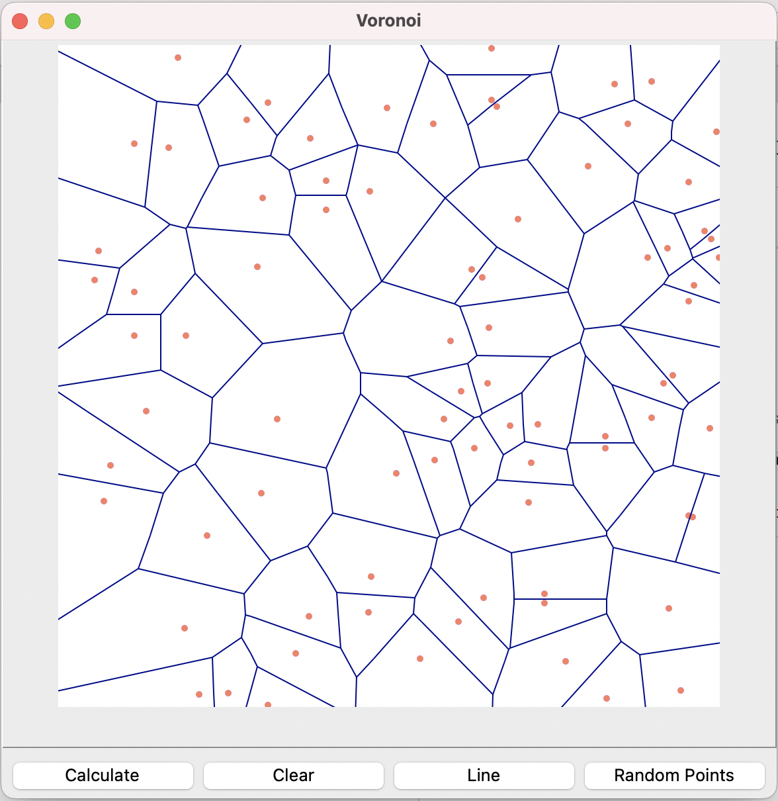
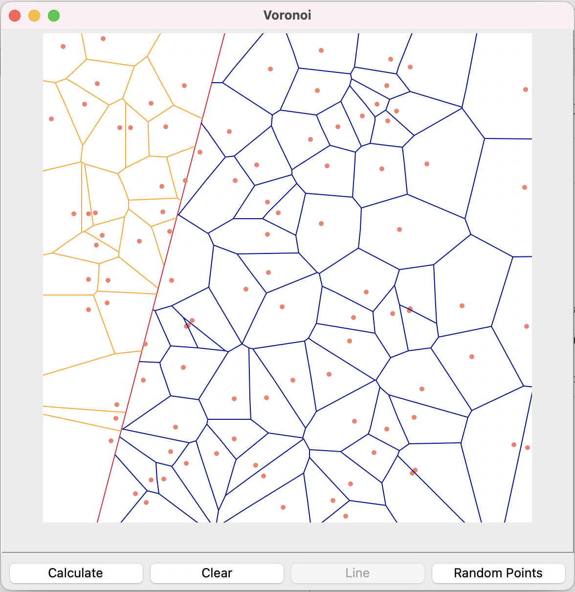

# TODO
- Implementace Fortune's sweepline algoritmu pro generování 2D Voroného teselací
   -    vor_classes.py: vytvoření objektů (point, edge, paraboly (beachline), ...)
   -    sweepline-sources:   
         - pseudocode: https://en.wikipedia.org/wiki/Fortune%27s_algorithm
         - https://jacquesheunis.com/post/fortunes-algorithm/  
         - https://github.com/njanakiev/fortune-algorithm  
         - https://github.com/dkotsur/FortuneAlgo
         - https://github.com/jansonh/Voronoi  
   - graphic interface - (asi v matplotlibu, případně přes pygame, [nebo přes cv2 ](https://stackoverflow.com/questions/60587273/drawing-a-line-on-an-image-using-mouse-clicks-with-python-opencv-library))   
- Implementovat pro překážky (přímka, možná něco složitějšího (?))  
- Pohyb buněk: náhodný, nebo pružinové chování hran  
- Regularizace?  

# Program structure
1. Logika pro generování sítě ve Voronoi.py
2. Třídy definované ve vor_classes.py
3. Soubor draw.py pro vykreslování

# Aktuální stav
- Voronoiovská mesh (Fortune's algorithm).
- Rošíření kódu o případ s lineárním rozhraním. (Ale buňky na rozhraní nemají společné vrcholy.)
- Automatická generace náhodných bodů.
- Náhodný pohyb buněk, nicméně bez vyhlazování sítě (křížení).  

   _voronoi.py: logika generování sítě_  
  _draw.py: tkinter okno pro interaktivní vizualizaci_  
  _vor_classes: objekty pro výpočet sítě_

  
   

